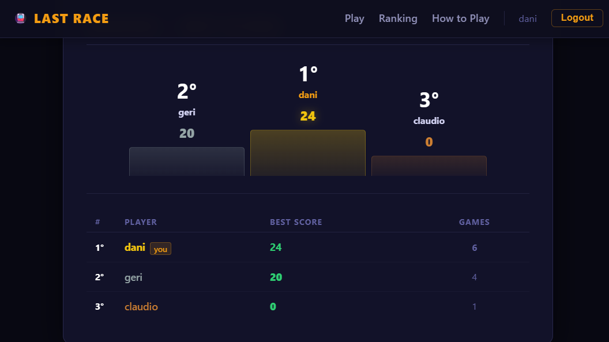
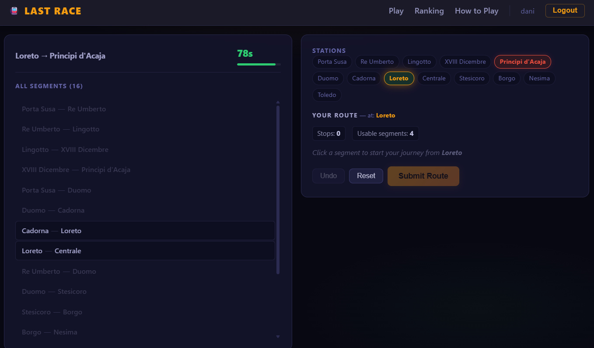

# Exam #1: "Last Race"

## Student: s346213 MEHMETAJ RAMADAN

## React Client Application Routes

- Route `/`: shows `HomePage` if logged in, `InstructionsPage` if anonymous
- Route `/login`: shows the login form; redirects to `/` if already logged in
- Route `/instructions`: shows the game rules (accessible to everyone)
- Route `/game`: runs the game (Setup → Planning → Execution → Result); protected, redirects to `/login` if not authenticated
- Route `/ranking`: shows the global leaderboard with best scores; protected, redirects to `/login` if not authenticated
- Route `*`: catch-all, shows `NotFoundPage` (404)

## API Server

- **POST `/api/sessions`**
  - Request body: `{ username, password }`
  - Response: user object `{ id, username }` on success; `401` with `{ error }` on failure

- **GET `/api/sessions/current`**
  - No parameters
  - Response: `{ id, username }` if authenticated; `401` if not

- **DELETE `/api/sessions/current`**
  - No parameters
  - Response: empty `200` — destroys the session

- **GET `/api/network`** *(auth required)*
  - No parameters
  - Response: array of lines, each with `{ id, name, stations: [{ id, name, position }] }` ordered by position

- **GET `/api/segments`** *(auth required)*
  - No parameters
  - Response: array of unique adjacent pairs `{ stationA: { id, name }, stationB: { id, name } }` — no line info

- **GET `/api/game/setup`** *(auth required)*
  - No parameters
  - Response: `{ startStation: { id, name }, destination: { id, name } }` — random pair at least 3 hops apart; stores the pair in the session

- **POST `/api/game/execute`** *(auth required)*
  - Request body: `{ route: [stationId, ...] }`
  - Response: `{ valid, steps: [{ fromStation, toStation, event: { description, effect }, coins }], finalScore }` — validates the route, applies random events, saves the score

- **GET `/api/ranking`** *(auth required)*
  - No parameters
  - Response: array of `{ username, score, games_played }` ordered by best score descending

## Database Tables

- Table `users` — registered users; stores `id`, `username`, `password_hash`, `salt` (scrypt)
- Table `lines` — metro lines; stores `id`, `name`
- Table `stations` — metro stations; stores `id`, `name`
- Table `line_stations` — maps stations to lines with their order; stores `line_id`, `station_id`, `position`
- Table `events` — random events that can occur on a segment; stores `id`, `description`, `effect` (integer −4 to +4)
- Table `games` — one row per completed game; stores `id`, `user_id`, `score`, `played_at`

## Main React Components

- `App` (in `src/App.jsx`): manages authentication state (user, loggedIn, loading), handles login/logout, and defines all client-side routes
- `NavBar` (in `src/components/NavBar.jsx`): top navigation bar; shows different links depending on whether the user is logged in
- `ProtectedRoute` (in `src/components/ProtectedRoute.jsx`): wrapper that redirects unauthenticated users to `/login`
- `GamePage` (in `src/pages/GamePage.jsx`): main game component; manages all four phases (loading, setup, planning, execution, result) through a single `phase` state
- `RankingPage` (in `src/pages/RankingPage.jsx`): fetches and displays the global leaderboard; highlights the current user's row
- `LoginPage` (in `src/pages/LoginPage.jsx`): login form; calls the `login` handler passed from `App`
- `HomePage` (in `src/pages/HomePage.jsx`): welcome screen for logged-in users with links to play, ranking, and instructions
- `InstructionsPage` (in `src/pages/InstructionsPage.jsx`): game rules page accessible to all users; shows a "Play Now" or "Log in" CTA depending on auth state
- `NotFoundPage` (in `src/pages/NotFoundPage.jsx`): 404 page shown on any unknown route; displays an error icon and a link back to home

## Screenshots

### Ranking Page

### During a Game (Planning Phase)

## Users Credentials

| Username | Password  |
|----------|-----------|
| dani     | password1 |
| geri     | password2 |
| claudio  | password3 |

## Use of AI Tools

AI tools were used throughout the development process in several ways.
On the front-end side, AI assistance helped refine and generate CSS styling for a consistent visual design. All suggested styles were reviewed and adjusted manually to fit the project's needs.
AI tools also supported debugging and the implementation of the game logic, proposing solutions that were then evaluated, tested, and integrated by hand.
Beyond the code, AI was useful in making architectural and organizational decisions — such as structuring client-server communication, splitting responsibilities between modules, and organizing the project layout.
Additional inspiration for the overall structure was drawn from the lab08 exercise, which served as a useful reference for the socket-based communication pattern and the general organization of a multiplayer client-server game.
